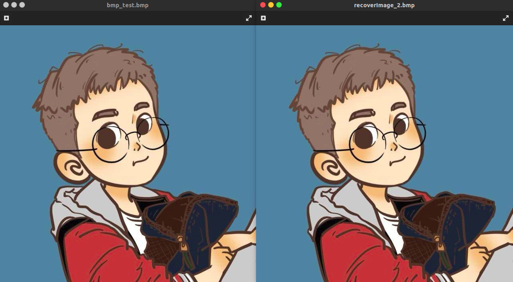
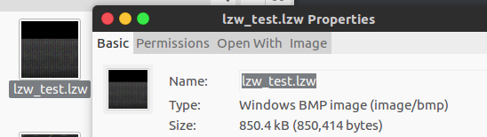
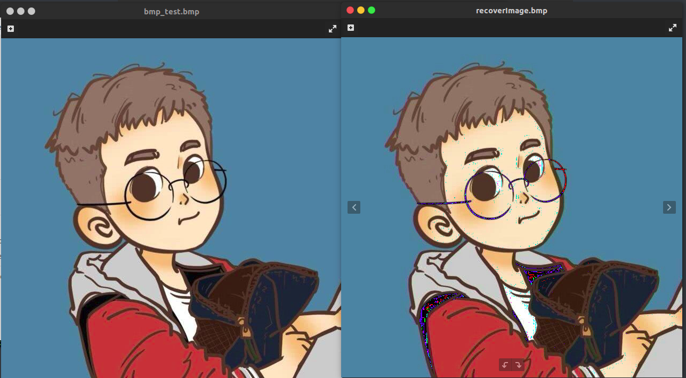
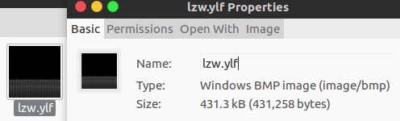

## 基于YUV色域转换和LZW编码的BMP图像压缩 

#### 项目语言
C++(std=C++11)

#### 操作系统
windos10＋ubuntu16.04　均测试通过

#### 文件要求

- 目前只支持BMP24位的图像格式．
- 提供两种压缩方式
  - 无损压缩：LZW压缩(生成文件后缀名为.lzw)
  - 有损压缩：RGB转YUV + LZW压缩(生成文件后缀名为.ylf)

#### 算法流程

- 压缩
  - 读取bmp文件，保存54位信息头，将剩余的数据BGR数据全部转为YUV格式的数据(由于转为YUV后数据是浮点型，而为了实现压缩功能，我们丢弃部分的精度，只保存Int型数据)，经过这一步转换就可以实现50%的压缩．
  - 转换后的YUV数据丢进LZW压缩算法．（注：有关LZW算法更多的信息可以参考我的个人博客 http://kevinnan.org.cn/index.php/archives/123/）
- 解压缩
  - 读取压缩文件，同样保存bmp的54位信息头，读取剩余所有数据丢进LZW解压缩算法得到YUV数据．
  - 将YUV数据转为BGR数据，即可恢复．

#### 项目结构


- image.h　用于存储图像信息
- ImageIO.h 用于读取和写入图像和压缩后的文件
- LZWcompress.h LZW编码与解码
- tools.h 常用的功能函数，如下．

#### 读取和写入图像二进制常用的函数

- Char2Hex ：将单个字符转为16进制字符串

比如，当要读取bmp图像中连续的四个字节数据，可先定义一个空字符串，然后依次读取四个字节分别调用此函数，每个字节会生成对应的16进制字符串，拼接这四个字符串．然后将该字符串转为对应的格式即可．加入要转为int，则调用`stoi(str, nullptr, 16)`即可转为int型．

```cpp
string Char2Hex(uchar c){
	const std::string hex = "0123456789ABCDEF";
	string ret;
	ret.push_back(hex[(c >> 4) & 0xf]); //取二进制高四位
	ret.push_back(hex[c & 0xf]);        //取二进制低四位
	return ret;
}
```

- splitStr ：c++划分字符串

由于c++ string本身并没有提供字符串划分函数，因此我自己实现了一个基于string的字符串划分函数，方便使用．

```cpp
std::vector<std::string> splitStr(const std::string &str,const std::string &pattern)
{
    std::vector<std::string> resVec;
	if ("" == str)
    {
        return resVec;
    }
    //方便截取最后一段数据
    std::string strs = str + pattern;
    size_t pos = strs.find(pattern);
    size_t size = strs.size();
    while (pos != std::string::npos)
    {
        std::string x = strs.substr(0,pos);
        resVec.push_back(x);
        strs = strs.substr(pos+1,size);
        pos = strs.find(pattern);
    }
    return resVec;
}
```

- bitset2char ：8位bitset类型转为char

在进行霍夫曼编码时，对编码后生成的01序列进行编码时，可调用c++提供的bitset函数库，然后保存到文件中可利用此函数将８位的bitset转为char方便保存．

```cpp
char bitset2char(std::bitset<8> bits)
{
	return (char)bitset<8>(bits.to_string()).to_ulong();
}
```

- Int2CharVector ：32位整数转4字节char型

在保存霍夫曼编码生成的权值表时，可将32位Int型数据转为chart字节char型，便于保存．

```cpp
std::vector<uchar> Int2CharVector(uint data){
	std::vector<uchar> buf;
	bitset<32> data_bit(data);
	string data_bit_str = data_bit.to_string();
	for(int i = 0; i < 4; i++){
		bitset<8> data_bit_part(data_bit_str.substr(i*8, 8));
		buf.push_back(bitset2char(data_bit_part));
	}
	return buf;
}
```

#### 运行方式

- 新建build目录，然后进入build目录

```
mkdir build
cd build
```

- cmake编译项目

```
cmake ..
```

- 如果编译成功，则会在build下生成Makefile文件，make编译即可

```
make
```

- 编译之后会生成名为`main2`的可执行文件，可直接运行

```
./main2
```

#### 测试运行结果

- 无损压缩





可以看到原图与压缩后恢复的图像基本没有差别

测试图片的压缩率为　C = b / b_ = 850.4KB / 1.2MB =  70.9% 

- 有损压缩





可以看到在边缘处，原图和压缩后复原的图像有明显差别，这是与YUV数据存储的格式相关．

测试图片的压缩率为　C = b / b_ =431.3KB / 1.2MB =  35.9%

对比无损压缩，可以发现将BGR数据转为YUV的确可以将数据压缩50%

#### 项目进度记录

##### 2020/7/5更新

代码风格从RGB转为YUV之后开始发生转变，原因是要开始使用STL提供的容器如vector, map等来替代c++原生的new动态数组．


##### 2020/7/6更新
将YUV格式数据经过LZW编码，实现空间压缩的效果．
最终生成图片的后缀 .ylh -- YUV+LZW+Huffman


##### 2020/7/7更新
完成lzw编码后的数据转换为霍夫曼编码
霍夫曼编码文件存储格式: bmp图像信息头　+ 权值表大小信息　+ 权值表　＋　霍夫曼编码结果

##### 2020/7/8更新
霍夫曼解码部分出现问题，在读取权值表之后生成霍夫曼树时，由于数据出现的频率有重复，因此构成的霍夫曼树不唯一，导致编码和解码的结果不一样．

解决方案一，把霍夫曼树生成的数据对应的编码代替权值表，但是要将bit序列转为char型保存在文件中后，再读取复原时会因为长度的原因会丢失编码表的信息，所以也不可取．
解决方案二，在保存霍夫曼树生成的编码表时，可以将bit序列的长度也保存，这样就不会因为读取而丢失信息．
最终，因为个人时间原因，我没有再去深究这个问题，即放弃使用霍夫曼编码．只采用了(1)RGB转YUV，和(2)LZW编码算法和编码YUV数据这两个步骤来实现bmp图像的压缩．我将霍夫曼编码相关的代码放在backup文件夹下．